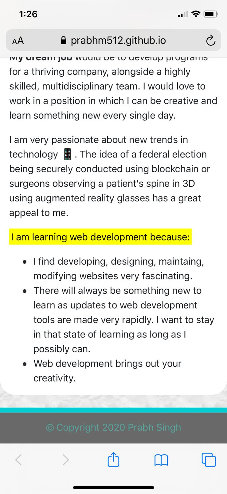

# Mobile Responsive Portfolio

## Description 

It is imperative that web applications render well on a variety of devices and window/screen sizes. 

The following factors have been considered in developing this portfolio:

- Aesthetically-pleasing
- Mobile-first
- Responsive design

## Tools & Technologies 

- Bootstrap layouts/components
- Media Queries
- Typography

## Visuals
 

 

  
## Project Status

Completed!

## <a href="https://prabhm512.github.io/">Deployed Project (click to view)</a>
