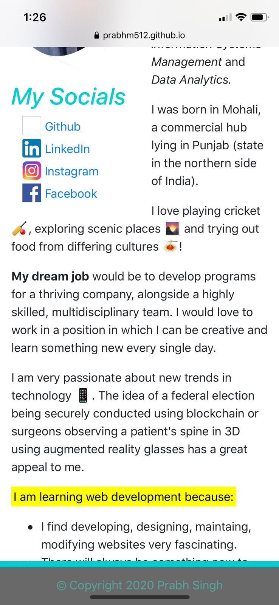
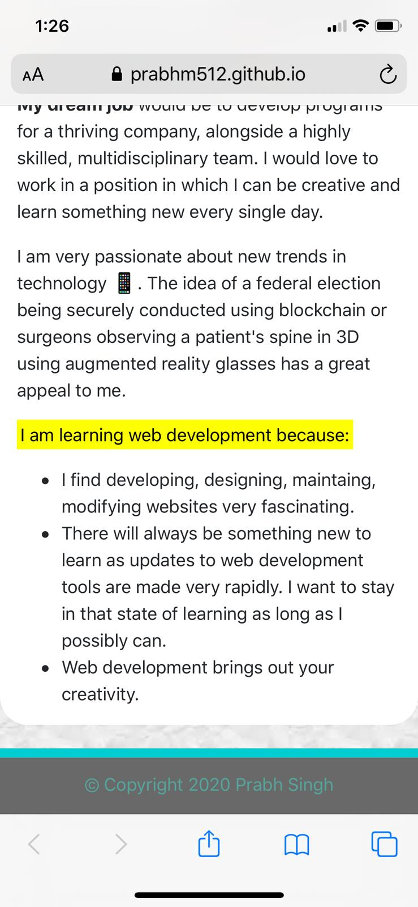

# Mobile Responsive Portfolio

## Description 

This is my personal portfolio. It gives more information about me and showcases my developments.

The following factors have been considered in developing this portfolio:

- Aesthetically-pleasing
- Mobile-first
- Responsive design

## Tools & Technologies 

- Bootstrap layouts/components
- Swiper API
- Content Filter
- Chaning buttons
- Git/GitHub
- VS Code

## Visuals
 

 

  
## Project Status

Completed!

## <a href="https://prabhm512.github.io/">Deployed Project (click to view)</a>

## Acknowledgements

<strong>Content Filter:</strong> <a href="https://twitter.com/romano_cla">@romana_cla</a> & <a href="https://twitter.com/guerriero_se">@guerriero_se</a>                     
<strong>Swiper API:</strong> <a href="https://github.com/nolimits4web">Vladimir Kharlampidi</a>     
<strong>Changing Button:</strong> <a href="https://codepen.io/thelaazyguy">thelaazyguy</a>
